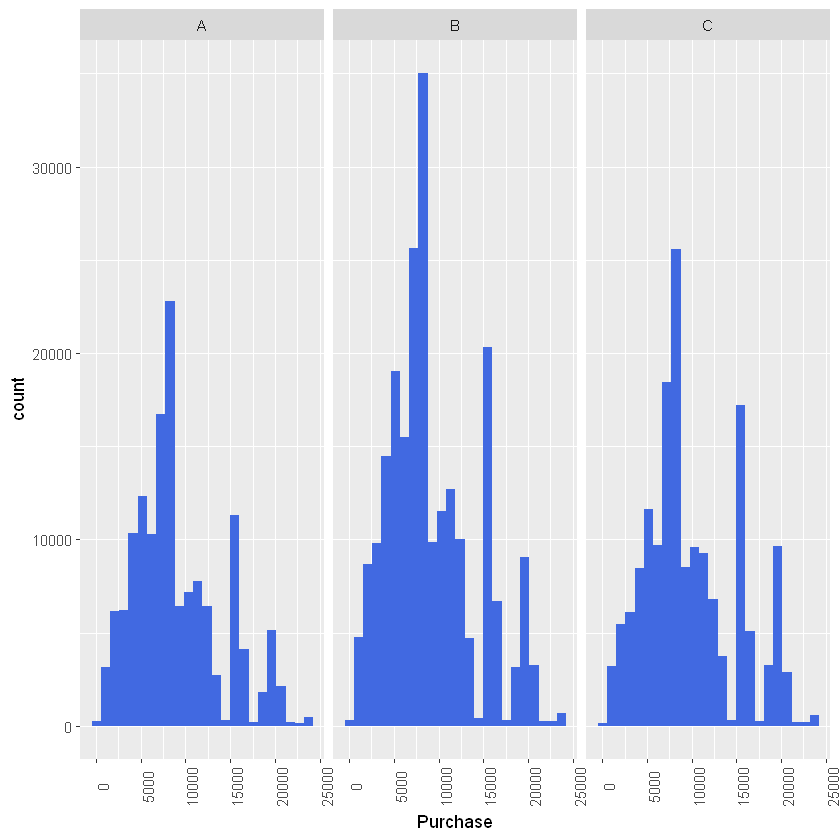

# Black_Friday_Analysis_R
An exploratory analysis in R of the different variables involved in the purchasing patterns of consumers on Black Friday in three different kinds of cities


```R
library(tidyverse)
library(ggrepel)
library(lubridate)
library(scales)
library(highcharter)
library(ggpubr)
```

    -- Attaching packages --------------------------------------- tidyverse 1.2.1 --
    v ggplot2 3.0.0     v purrr   0.2.5
    v tibble  1.4.2     v dplyr   0.7.6
    v tidyr   0.8.1     v stringr 1.3.1
    v readr   1.1.1     v forcats 0.3.0
    -- Conflicts ------------------------------------------ tidyverse_conflicts() --
    x dplyr::filter() masks stats::filter()
    x dplyr::lag()    masks stats::lag()
    


    Error in library(ggrepel): there is no package called 'ggrepel'
    Traceback:
    

    1. library(ggrepel)

    2. stop(txt, domain = NA)


```R
b <- read_csv("BlackFriday.csv")
```

    Parsed with column specification:
    cols(
      User_ID = col_integer(),
      Product_ID = col_character(),
      Gender = col_character(),
      Age = col_character(),
      Occupation = col_integer(),
      City_Category = col_character(),
      Stay_In_Current_City_Years = col_character(),
      Marital_Status = col_integer(),
      Product_Category_1 = col_integer(),
      Product_Category_2 = col_integer(),
      Product_Category_3 = col_integer(),
      Purchase = col_integer()
    )
    


```R
b_cat <- b%>% 
  gather(product_cat, category, c("Product_Category_1", "Product_Category_2", "Product_Category_3")) %>%
  select(-product_cat) %>%
  filter(!is.na(category))
```

## Categories

Let's look at what we have for the occupation of customers.


```R
b %>% group_by(User_ID) %>% filter(row_number(User_ID) == 1) %>% group_by(Age, Occupation) %>% summarize(occupationCount = n()) %>% ggplot(aes(x = Occupation, y = occupationCount)) + geom_area(fill = "royalblue") + facet_grid(Age~.)
```


Based on these results we could assume that occupation 10 is School and 4 - College/University. Occupation 10 is most widespread among 0-17 years old customers whereas, occupation 4 - among 18-25 and than 26-35 age group.

Next on we look at the preferences of both occupation groups(4 and 10) in regards to product categories:


```R
student_customers_count <- b_cat %>% group_by(User_ID, Occupation, City_Category, category) %>%
filter(Occupation %in% c(4, 10)) %>% summarise(total_items_bought = n()) %>%
group_by(City_Category, Occupation, category) %>% summarise(total_items_bought = sum(total_items_bought)) %>%
ungroup() %>% mutate(Occupation = ifelse(Occupation == 4, "4 - Supposedly University/College", "10 - supposedly School"),
Occupation = factor(Occupation)) %>% arrange(Occupation, City_Category, category)
```


```R
student_customers_count %>% ggplot(aes(x = category, y = total_items_bought, fill = Occupation)) +
geom_bar(stat = "identity", position = position_dodge()) + facet_wrap(City_Category~.) +
ggtitle("Total items bought by occupation 4 and 10 across categories and cities")
```


It appears that students (at school) buy much less products than university students in  city A, In contrast to city C where the former have more buying power.


## Most popular categories


```R
b_cat %>%
  group_by(category) %>%
  summarise(spent_per_category = sum(Purchase)) -> spent_per_category

spent_per_category %>%
  ggplot(aes(x = category, y = spent_per_category/1000000000)) +
  geom_bar(stat = "identity", fill = "royalblue") +
  ylab("Total purchases per categories (in billions, *10^9)") +
  ggtitle("Most purchased categories")

```


Category 1 leads the race with a "slight" lead over 5 and 8.

## Mean price of bought products across categories

This is another way of assessing the categories as their popularity does not tell it all.


```R
b_cat %>%
  group_by(category) %>%
  summarise(total_sales_per_category = n()) %>%
  left_join(spent_per_category, by = "category") %>%
  mutate(spent_sales_ratio = spent_per_category/total_sales_per_category) %>%
  ggplot() +
  geom_bar(stat = "identity", aes(x = category, y = spent_sales_ratio), fill = "royalblue") +
  ggtitle("Purchase/sales ratio across categories")
```


Here we see that two of the most popular categories 5 and 8 have a relatively low mean price. On the other hand category 1 seems to be the more expensive in regards to mean product price.


# Products

## Product prices

Next we look at the frequency count of different product prices across the three cities.


```R
b %>%
  select(Purchase, City_Category) %>%
  ggplot() +
  geom_histogram(aes(x = Purchase), bins = 24, fill = "royalblue") +
  facet_wrap(City_Category~.) +
  theme(axis.text.x.bottom = element_text(angle = 90))
```





The purhasing pattern is very similar in all three city categories.  There are 2 interesting spikes:
* in the 7-9K range;
* in the 15-17K range.

We look at there in the next figure.


```R

plot_linetype <- list(15000, "dashed", "orange", 2)
```


```R
aplot <- b_cat %>%
  filter(Purchase > 6999 & Purchase < 9000) %>%
  group_by(category) %>%
  summarise(catCount = n()) %>%
  ggplot(aes(x = category, y = catCount)) +
  geom_bar(stat = "identity", fill = "royalblue") +
  geom_hline(yintercept = plot_linetype[[1]], linetype = plot_linetype[[2]],
             color = plot_linetype[[3]], size = plot_linetype[[4]]) +
  ggtitle("Sales count in the 7-9K range")
```


```R
bplot <- b_cat %>%
  filter(Purchase > 14999 & Purchase < 17000) %>%
  group_by(category, Age) %>%
  summarise(catCount = n()) %>%
  ggplot(aes(x = category, y = catCount)) +
  geom_bar(stat = "identity", fill = "royalblue") +
  geom_hline(yintercept = plot_linetype[[1]], linetype = plot_linetype[[2]],
             color = plot_linetype[[3]], size = plot_linetype[[4]]) +
  ggtitle("Sales count in the 15-17K range")
```

## Average number of bought items across cities
 


```R
#Customers and number of sales vs cities
#There is much less number of customers in A and B than in city C
customer_count_per_city <- b %>%  
  group_by(User_ID) %>%
  filter(row_number(User_ID) == 1) %>%
  group_by(City_Category, Age) %>%
  summarise(customers_count = n()) %>%
  arrange(City_Category, Age)
```


```R
#Even though city A has less sales than city C, it has more sales in the 26-35 age range, whereas city C has twice as much sales in the 46-55+ age category
#That signifies that the customers in city A tend to be younger than those in city C
citySales <- b %>%
  group_by(City_Category)%>%
  summarise(sold_by_city = n(), 
            percentage_by_city = round(n()/nrow(b)*100,0))
```


```R
ggarrange(
  customer_count_per_city %>%
    ggplot(aes(x = City_Category, y = customers_count, fill = Age)) +
    geom_bar(stat = "identity", position = position_dodge()) +
    ggtitle("Number of customers across cities"))
  
```


    Error in ggarrange(customer_count_per_city %>% ggplot(aes(x = City_Category, : could not find function "ggarrange"
    Traceback:
    


```R
#Average number of bought items across cities
  #Three very different patterns
  b %>%
    group_by(User_ID, City_Category, Age) %>%
    summarise(bought_items = n()) %>%
    group_by(City_Category, Age) %>%
    summarise(items_bought_per_city = sum(bought_items)) %>%
    arrange(City_Category, Age) %>%
    cbind(customers_count = customer_count_per_city$customers_count) %>%
    mutate(average_items_per_person_in_city = items_bought_per_city/customers_count) %>%
    ggplot(aes(x = City_Category, y = average_items_per_person_in_city, fill = Age)) +
    geom_bar(stat = "identity", position = position_dodge()) +
    ggtitle("Average number of bought items across cities")
  
  

```


```R
b %>%
    group_by(City_Category, Age) %>%
    summarise(sales = n()) %>%
    left_join(citySales, by = "City_Category") %>%
    mutate(percentage = round(sales/sold_by_city*100, 0),
           percentage = ifelse(percentage < 3, "", as.character(paste0(percentage, "%")))) %>%
    select(-percentage_by_city) %>%
    ggplot(aes(x = City_Category, y = sales, fill = Age)) +
    geom_bar(stat="identity", position = position_dodge()) +
    ggtitle("Number of sales across age groups in the three cities")
  
```


```R
  b %>%
    group_by(City_Category) %>%
    summarise(sales = n(), 
              percentage_by_city = paste0(round(n()/nrow(b)*100,0), "%")) %>%
    ggplot(aes(x = City_Category, y = sales)) +
    geom_bar(stat="identity", fill = "royalblue") +
    geom_text(aes(label = percentage_by_city),
              vjust=1.6, 
              color="white",
              size=8) +
    ggtitle("Number of sales in the three cities")
```


City C sees less sales not because of the lack of customers but rather because on average they buy much less products than in other cities.

# Customers

## Stay in the city

Let's look at how the number of customer is influenced by the duration of stay in the city across age groups.


```R
b %>%  
  group_by(User_ID) %>%
  filter(row_number(User_ID) == 1) %>%
  group_by(Age, Stay_In_Current_City_Years, City_Category) %>%
  summarise(customer_count = n()) %>%
  ggplot(aes(Age, customer_count, fill = Stay_In_Current_City_Years)) +
  geom_bar(stat = "identity", position = position_dodge()) +
  facet_wrap(City_Category~.) +
  theme(axis.text.x.bottom = element_text(angle = 90))
```


The most prominent category is the one of customers living for no more than an year in this city. Together with the fact the most clients are aged 25-36 it somehow leads me to the idea that the store itself could be selling furniture.

# Gender patterns


```R
library(ggplot2)

```


```R
ggarrange(
  b %>%
    group_by(Age, Gender, City_Category) %>%
    summarise(count = n(),
              percentage = round(n()/nrow(b)*100, 1)) %>%
    ggplot(aes(x = Age, y = percentage, fill = Gender)) +
    geom_bar(stat = "identity") +
    facet_wrap(City_Category~.) +
    ylab("Percentage of total purchases") +
    ggtitle("Age and gender profile of customers across cities") +
    theme(axis.text.x.bottom = element_text(angle = 90)))
```


    Error in ggarrange(b %>% group_by(Age, Gender, City_Category) %>% summarise(count = n(), : could not find function "ggarrange"
    Traceback:
    


```R
  b %>%
    group_by(Age, Gender, City_Category) %>%
    summarise(count = n()) %>%
    spread(Gender, count) %>%
    mutate(men_women_ratio = M/F) %>%
    ungroup() %>%
    select(-M, -F) %>%
    ggplot(aes(x = Age, y = men_women_ratio)) +
    geom_bar(stat = "identity", position = position_dodge(), fill = "royalblue") +
    facet_wrap(City_Category~.) +
    ggtitle("M/F customers ratio across cities") +
    theme(axis.text.x.bottom = element_text(angle = 90))
```


it seems that most of the customer are in the 18-45 Age group. Approximatelly 40 % of all purchases have been made by people from the 25-36 group. A peculiar difference between city A and C is that the latter sees rather more sales in the 46+ age groups. On the other hand, city B had more than 40 % of all sales.


```R
b_users <- b %>%
  group_by(User_ID, Age, Gender, Marital_Status, Occupation, City_Category) %>%
  summarise(av_purchase = mean(Purchase),
            sum_purchase = sum(Purchase),
            products_bought = n())
```


```R
ggarrange(
  b_users %>%
    ggplot(aes(Age, y = products_bought, fill = Gender)) +
    geom_boxplot(aes(middle = mean(products_bought))) +
    facet_wrap(City_Category~.),
  
  b_users %>%
    ggplot(aes(Age, y = av_purchase, fill = Gender)) +
    geom_boxplot(aes(middle = mean(av_purchase))) +
    facet_wrap(City_Category~.),
  
  b_users %>%
    ggplot(aes(Age, y = sum_purchase, fill = Gender)) +
    geom_boxplot(aes(middle = mean(sum_purchase))) +
    facet_wrap(City_Category~.),
  nrow = 3, common.legend = TRUE)
